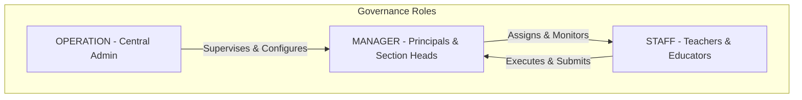
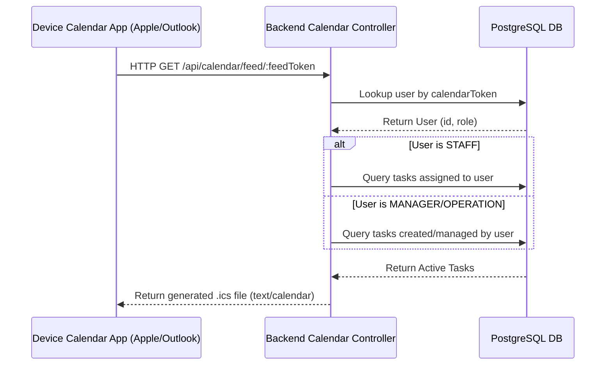

# Mahatma Global Gateway School - Master Project Handover & System Architecture Report

This definitive Master Project Handover & System Architecture Report serves as the primary engineering ledger and administrative blueprint for the centralized TaskFlow administrative portal delivered to Mahatma Global Gateway School. It details the system design, complete technology stack, and core architectural decisions of the final production platform.

---

## 1. Executive Vision & Operational Transition
The primary objective of the Mahatma Global Gateway School TaskFlow portal is to modernize institutional operations by consolidating administrative task distribution, academic tracking, and inter-departmental scheduling into a unified, secure web application. 

Prior to this system's implementation, the school relied on scattered, unstructured channels such as WhatsApp threads, email notifications, and verbal handovers. This administrative overhead resulted in fragmented communications, delayed deliverables, and poor visibility for management. By migrating operations to the TaskFlow portal, Mahatma Global Gateway School establishes a robust operational baseline. Task dispatches, progress audits, and feedback loops are systematically logged, tracked, and automatically synchronized to users' device calendars, ensuring operational alignment.

---

## 2. Complete Enterprise Technology Stack Overview
The TaskFlow application is built upon a highly modular, containerized multi-tier architecture to ensure scalability, reliability, and security:

*   **Frontend Client Layer**:
    *   **Architecture**: Built using Vite & React Router (SPA runtime layout) configured with strict static TypeScript validation rules.
    *   **Design & Layout System**: Utilizes custom CSS rules and Tailwind CSS utilities to render a responsive interface.
    *   **Iconography & Design Tokens**: Uses Lucide icons and customized Radix UI component primitives (Modals, Dialogs, Dropdowns, Tabs) to provide a fluid user experience.
*   **Backend API Ecosystem**:
    *   **Runtime & Server Environment**: Powered by Node.js and Express hosting RESTful routing controllers.
    *   **Security & Middleware Infrastructure**: Utilizes JSON Web Token (JWT) parsing middleware to authorize incoming requests. Contains route exemptions to permit tokenized external queries without browser cookies.
    *   **Real-Time Push Architecture**: Powered by a lightweight Server-Sent Events (SSE) server tracking live database mutations and immediately pushing updates.
*   **Database & Persistence Layer**:
    *   **Object-Relational Mapping (ORM)**: Prisma client with full PostgreSQL schema modeling.
    *   **Prisma Client Operations**: Leverages strict type-safety across all database operations, utilizing auto-generating ID mappings, relational schema cascades, and migrations.
*   **Testing & Quality Assurance Infrastructure**:
    *   **End-to-End browser validation**: Powered by the Playwright browser automation framework. Runs automated test scripts validating authorization handshakes, settings menus, and sync links.
    *   **Integration Tests**: Run via Vitest to verify API routes, notification alerts, and database integrity.

---

## 3. 3-Tier Governance & Access Control Architecture
To secure administrative boundaries, the platform enforces a strict Role-Based Access Control (RBAC) model implemented at both the database layer and API route levels:



*   **OPERATION (Global System Admin)**:
    *   *Privilege Boundaries*: Unrestricted macro visibility across all branches, departments, and user profiles.
    *   *Operational Scope*: Configuration overrides, school-wide deliverables analytics, and user account creation.
*   **MANAGER (Principals & Section Heads)**:
    *   *Privilege Boundaries*: Departmental and school-wide administrative monitoring capabilities.
    *   *Operational Scope*: Access to task generation panels, due date adjustment engines, and task submission assessment controls. Contains a built-in feedback comment block to support live collaboration with assigned staff.
*   **STAFF (Teachers & Educators)**:
    *   *Privilege Boundaries*: Isolated workspaces displaying personal tasks.
    *   *Operational Scope*: Complete assigned checklists, attach files or link uploads for submissions, write comments, and access personal device calendar sync panels.

---

## 4. Universal Background Calendar Streaming Engine
One of the core features of the TaskFlow portal is the ability to securely synchronize administrative tasks directly to staff members' native desktop and mobile calendar applications without requiring a browser session:



*   **Centralized UX Overhaul**: 
    All calendar integration and synchronization tools are unified within a single **Sync to Device** dialog modal on the main Calendar page, removing redundant tabs from Settings.
*   **Cryptographic Separation**: 
    To maintain data privacy, each user has a unique `calendarToken` defined in [schema.prisma](file:///C:/Users/Kaushikan/.gemini/antigravity/scratch/taskspring-rise/backend/prisma/schema.prisma) that defaults to an automatically generated cryptographic hash:
    ```prisma
    calendarToken String @unique @default(cuid())
    ```
    External sync clients retrieve calendars by querying the unauthenticated route: `GET /api/calendar/feed/:feedToken`. The backend controller looks up the associated user and resolves their permissions:
    *   **STAFF**: Streams only tasks assigned to them (`assignedToId = user.id`).
    *   **MANAGER / OPERATION**: Streams all tasks they oversee or manage.
*   **Dual-Mode Synchronization Engine**:
    *   *Staging/Production (Webcal Sync)*: Exposes direct `webcal://${host}/api/calendar/feed/${token}` hyperlinks. Clicking this instantly registers a background subscription in Windows Mail, Outlook, macOS Calendar, iOS, or Android.
    *   *Localhost Fallback (TEMPLATE Web-Intent)*: During local development, webcal cloud relays cannot access local servers. To bypass this, the button dynamically detects `localhost` and instead opens a Google Calendar Event Template URL that pre-fills task parameters (Title, Description, and Due Date formatted in dynamic UTC strings) directly into the user's browser, permitting local testing.

---

## 5. Hands-Off Operational Synchronization Workflow
The automated calendar sync pipeline operates as a continuous, hands-off background workflow:

1.  **Administrative Action**: A school coordinator edits or creates an assignment at midnight. The updates are saved to the database.
2.  **External Client Polling**: Third-party calendar servers (e.g., Apple, Google, Microsoft Exchange) systematically query the user's secure calendar token URL at regular intervals.
3.  **Dynamic Rendering**: The backend server parses active tasks, compiles them into a standard `.ics` formatted calendar file, and returns the response.
4.  **Local Device Render**: The updated deadlines land on the staff member's local device calendar grid on the precise due dates, requiring no manual actions from the user.

---

## 6. Audited Worker Log & Notification Preferences
The notification panel is built upon preference configurations that map directly to automated background jobs and event triggers:

*   **Deadline Reminders (Impending Horizon Chron)**: Runs on a 24-hour background scheduler to trace tasks due within 48 hours or those currently overdue. Sends alerts directly to the user's dashboard.
*   **Submission Approvals**: Action-based real-time dispatches. When a staff member submits a deliverable, the backend routes an SSE notification directly to the manager's queue.
*   **Weekly Digest**: An automated job scheduled for Monday morning that packages institutional progress highlights and distributes summaries to school leaders.

---

## 7. Stability, Code Integrity, & Deployment Assurance
To ensure production stability, the repository integrates strict validation checkmarks:

*   **Strict Compiler Validation**: Executing `npm run build` compiles all frontend components and backend ts files with no errors or type warnings.
*   **Playwright E2E Test Suite**: Configured with a session storage injection mock that signs and injects a mock `MANAGER` user profile. This bypasses network authorization loops, validating that:
    1.  The calendar view compiles.
    2.  The **Sync to Device** modal loads.
    3.  The dynamic calendar intent URLs compile correctly.
*   **Vitest Integration Verification**: Validates REQ-008 notification middleware, verifying that task mutations automatically route notifications to the correct manager streams.
