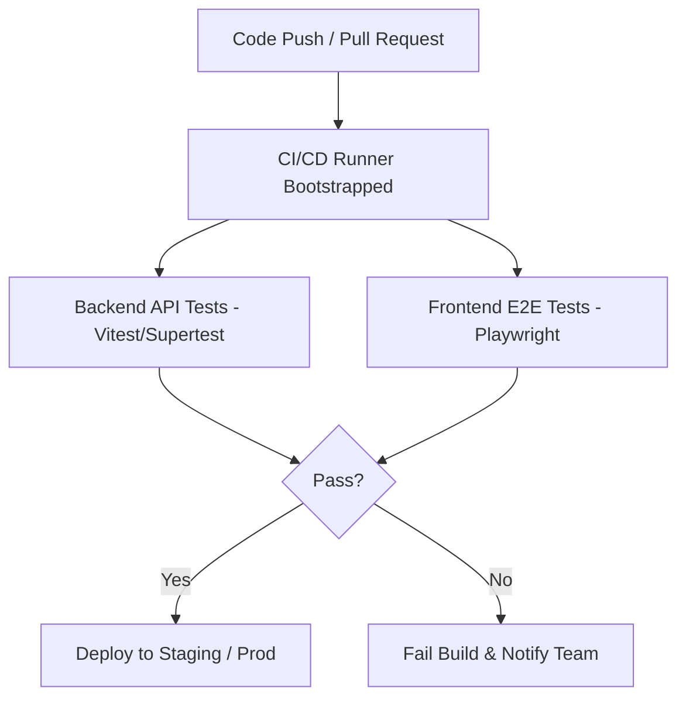

# QA Testing Pipeline & Verification Strategy
## Mahatma Global Gateway TaskFlow

This document establishes the official QA testing pipeline, test configurations, and execution strategies for both the backend API and frontend E2E verification suites.

---

## 1. Pipeline Overview
The testing pipeline ensures system stability, database integrity, and correct desktop/calendar integration behavior. It is split into three layers:



---

## 2. Backend API Integration Testing Suite

Backend integration tests check route access control, task CRUD operations, database queries, and iCalendar feed rendering.

### Tech Stack
* **Framework**: Vitest (or Jest)
* **HTTP Assertions**: Supertest
* **Database Isolation**: SQLite test database (flushed before each suite)

### Sample Test Case File: `backend/src/tests/api.test.ts`
```typescript
import request from "supertest";
import { describe, it, expect, beforeEach, afterAll } from "vitest";
import app from "../server";
import { db } from "../db";

describe("TaskFlow Backend API Integration Suite", () => {
  beforeEach(async () => {
    // Clear and re-seed the test database before each run
    await db.task.deleteMany({});
    await db.user.deleteMany({});
  });

  afterAll(async () => {
    await db.$disconnect();
  });

  describe("GET /api/tasks/ical/:userId", () => {
    it("should return a valid iCalendar feed for an active user", async () => {
      // 1. Create a mock user
      const user = await db.user.create({
        data: {
          id: "test-user-001",
          email: "tester@mgg.edu.in",
          name: "Test User",
          role: "STAFF",
        },
      });

      // 2. Create a mock task assigned to the user
      await db.task.create({
        data: {
          id: "task-001",
          title: "Math Curriculum Design",
          description: "Design syllabus for grade 9 algebra.",
          status: "pending",
          dueDate: new Date(Date.now() + 86400000).toISOString(), // 24 hours from now
          assignedTo: user.id,
        },
      });

      // 3. Request the calendar feed
      const response = await request(app)
        .get(`/api/tasks/ical/${user.id}`)
        .expect(200);

      // 4. Assert calendar headers and structure conforming to RFC 5545
      expect(response.headers["content-type"]).toContain("text/calendar");
      expect(response.text).toContain("BEGIN:VCALENDAR");
      expect(response.text).toContain("SUMMARY:Math Curriculum Design");
      expect(response.text).toContain("END:VCALENDAR");
    });

    it("should handle invalid or missing user IDs gracefully", async () => {
      const response = await request(app)
        .get("/api/tasks/ical/nonexistent-user")
        .expect(200);

      // Should return an empty calendar but still be valid .ics
      expect(response.text).toContain("BEGIN:VCALENDAR");
      expect(response.text).not.toContain("BEGIN:VEVENT");
    });
  });
});
```

---

## 3. Frontend End-to-End (E2E) Verification

Frontend E2E tests mimic user actions—such as logging in, navigating the dashboard, triggering notifications, and executing calendar synchronization.

### Tech Stack
* **Framework**: Playwright
* **Language**: TypeScript

### Sample Test Case File: `frontend/e2e/calendar.spec.ts`
```typescript
import { test, expect } from "@playwright/test";

test.describe("TaskFlow Settings & Calendar Sync Verification", () => {
  test.beforeEach(async ({ page }) => {
    // 1. Visit login and authenticate
    await page.goto("http://localhost:8080/login");
    await page.fill('input[type="email"]', "priya@mgg.edu.in");
    await page.fill('input[type="password"]', "password123");
    await page.click('button[type="submit"]');
    
    // Wait for redirect to dashboard
    await expect(page).toHaveURL("http://localhost:8080/");
  });

  test("should automatically trigger webcal protocol on first dashboard load", async ({ page }) => {
    // 1. Clear localStorage to simulate first-time machine load
    await page.evaluate(() => localStorage.clear());
    
    // 2. Reload page to trigger Layout useEffect
    await page.reload();

    // 3. Intercept protocol launch request
    const protocolPromptPromise = page.waitForEvent("console", {
      predicate: (msg) => msg.text().includes("Automatically triggering calendar sync link:"),
    });

    await page.waitForTimeout(3500); // Wait for the 3-second layout trigger

    // 4. Verify localStorage has marked calendar as synced
    const isSynced = await page.evaluate(() => localStorage.getItem("mgg_cal_synced_s1"));
    expect(isSynced).toBe("true");
  });

  test("should download the calendar feed when clicking Sync Automatically in settings", async ({ page }) => {
    // 1. Navigate to Settings page
    await page.goto("http://localhost:8080/settings");
    await page.click('button[value="calendar"]'); // Open Calendar Sync Tab

    // 2. Trigger direct download click
    const downloadPromise = page.waitForEvent("download");
    await page.click('button:has-text("Sync Automatically")');
    const download = await downloadPromise;

    // 3. Assert correct file name is downloaded
    expect(download.suggestedFilename()).toContain("tasks_");
    expect(download.suggestedFilename()).toContain(".ics");
  });
});
```

---

## 4. Local Execution & Script Commands

To run tests locally before pushing to the repository, configure the package scripts:

### Backend Scripts (`backend/package.json`)
```json
"scripts": {
  "test": "vitest run",
  "test:watch": "vitest",
  "test:coverage": "vitest run --coverage"
}
```

### Frontend Scripts (`frontend/package.json`)
```json
"scripts": {
  "test:e2e": "playwright test",
  "test:e2e:ui": "playwright test --ui"
}
```

---

## 5. CI/CD Pipeline Configuration (GitHub Actions)

Add this action configuration to automate test verification on every pull request.

Create file `.github/workflows/verify.yml`:
```yaml
name: TaskFlow CI Verification Pipeline

on:
  push:
    branches: [ main ]
  pull_request:
    branches: [ main ]

jobs:
  verify:
    runs-on: ubuntu-latest

    services:
      db:
        image: sqlite

    steps:
    - name: Checkout Code
      uses: actions/checkout@v4

    - name: Setup Node.js
      uses: actions/setup-node@v4
      with:
        node-version: 20
        cache: 'npm'

    - name: Install Root Dependencies
      run: npm install

    - name: Run Backend Tests
      run: |
        cd backend
        npm install
        npx prisma db push
        npm run test

    - name: Install Playwright Browsers
      run: npx playwright install --with-deps

    - name: Run Frontend E2E Tests
      run: |
        cd frontend
        npm install
        npm run build
        npx playwright test
